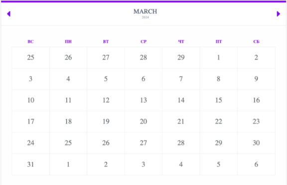

## Профессионалы `Веб разработка` `Модуль Г`

> [!TIP] 
> Для компиляции SСSS в CSS: `npm run scss`

### Разработка интерфейса пользователя

1. Дано изображение, сделайте его в оттенках серого, наложите эффект 
размытия. 

2. Создайте UI-комплект из следующих элементов: текстовое поле, 
кнопка, выпадающий список, чекбокс, радиокнопка, метка с 
чекбоксом, метка с радиокнопкой, выпадающий календарь ввода, 
диапазон, прогресс-бар.

3. С помощью CSS/HTML сделать 3D-куб, который медленно 
бесконечно вращается. Каждая грань куба должна дополнительно 
поделена на 9 частей. 
(нельзя использовать изображения)

4. Вам предоставляется спрайт таблица (sprite sheet) с персонажем ее 
необходимо анимировать. Персонаж должен бежать слева на права 

5. Сделать адаптивный макет (только секции) для блога: шапка, 
основная (в основной секции необходимо реализовать блоки для постов. Ширина постов составляет ⅓ ширины контейнера), боковая 
панель, футер. Макет должен корректно отображаться в следующих 
значениях ширины: ≥576px, ≥768px, ≥992px.

6. Создание тумблера для IOS с использованием только HTML и CSS. 

### Разработка на стороне клиента

7. Создать генератор цветов RGB. При перемещении соответствующих ползунков должен изменяться цвет и выводится RGB код.

8. Создайте экранную клавиатуру. При клике по кнопке в поле ввода должен записаться соответствующий символ. Shift переключает регистр.

9. Создайте арифметическую функцию, которая при вводе строки выражения возвращает вычисленный результат. Эта функция должна включать следующие операторы, перечисленные в порядке по приоритету: 
   1. Круглые скобки: ()
   2. Знак минус: -
   3. Экспоненция: ^
   4. Умножение, деление, модуль: * / %
   5. Сложение, вычитание: + -
   
   - Пример 1: 
     - Ввод функции: 1+2*3 
     - Выход функции: 7 
   - Пример 2: 
     - Вход функции: 3^2%5 
     - Выход функции: 4 
   - Пример 3: 
     - Вход функции: (-1-2)

10. Вам необходимо реализовать часы, показывающие текущее местное системное время. Фон должен выглядеть так, как показано в медиафайле «clock.png», содержащем границы часов и тики для часов и минут. Также стрелки часов должны выглядеть так, как показано на изображении. Секундная стрелка часов обновляется каждую секунду, минутная стрелка обновляется каждую минуту, часовая стрелка обновляется каждую минуту. Изображение «clock.png» можно использовать по своему усмотрению.

11. Попробуйте использовать холст, чтобы создать блокнот для рисования со следующими возможностями:  
   - Рисование с помощью нажатия и перемещения мыши  
   - Переключение 3 цветов 

### Разработка на стороне сервера

12. С помощью PHP/Python для создания изображения проверочного 
кода (captcha), которое должно соответствовать следующим 
правилам: 
a. Случайным образом генерировать четыре символа, состоящих из 
английского алфавита (A-Z) или цифр 
цифр (0-9). 
b. Четыре символа должны быть слегка повернуты. 
c. Четыре символа не должны располагаться в одном ряду. 
d. Изображение содержит не менее 3 случайных линий. 
e. Не менее 3 точек смешанного шума.

13. ?

14. Реализуйте загрузку файлов с автоматической сортировкой по 
папкам в зависимости от типа файла (images, videos, documents 
(docx, pdf, xls) audio, fonts). Файлы должны быть названы датой и 
временем его загрузки. Например: 2024_05_28_15_13.png

15. Вам предоставляется несколько массивов в медиафайлах, 
реализуйте PHP/Python-функцию, которая сравнивает два заданных 
массива и возвращает новый массив, содержащий общие элементы 
из обоих заданных массивов.

16. Реализуйте календарь 
1) Вы можете создать index.php, используя index.html 
2) Когда вы откроете index.php, в верхней области календаря 
должны отображаться текущий месяц и текущий 
год, а сегодняшняя дата должна быть выделена, как в index.html. 
3) При нажатии на кнопку со стрелкой влево должен отображаться 
календарь предыдущего месяца. 
4) При нажатии на кнопку со стрелкой вправо должен быть показан 
календарь на следующий месяц.

### Разработка информационных ресурсов с использованием готовых решений

17. Установите wordpress. Данные для авторизации администратора: 
Логин: admin2024 
Пароль: profmaster404 
Установите и активируйте тему BlankSlate 

18. Приведите внешний вид темы в соответствие с предоставленным 
шаблоном. Все стили должны быть сохранены, как и интерактивные 
элементы. Измените изображение тему 

19. Создайте плагин, который показывает время, оставшееся до 1 
сентября. 
При активации плагина создается виджет. При добавлении виджета 
в сайдбар должно отображаться оставшееся время в левом нижнем 
углу на каждой странице. Дата не должна быть статичной. Формат 
даты (ДД: ЧЧ: ММ: СС) 
Название плагина: «Обратный отсчет»

20. Сделайте плагин, который позволит загружать несколько 
медиафайлов в галерею wordpress с помощью пункта меню (в 
шаблоне) под названием «Загрузка галереи» 

21. Создайте плагин, который выводит на Dashboard кнопку «Статус 
технических работ», на странице должна быть возможность 
переключить сайт в статус «технические работы» при этом у 
клиентской части сайта должна отображаться страница «Идут 
технические работы». При отключении технических работ, сайт 
должен быть снова доступен

22. Создайте плагин интернет-магазина. При активации плагина в 
панели администратора добавляется пункт меню «Магазин» при 
нажатии на который открывается еще два пункта «Добавить товар» 
и «Добавить категорию». При нажатии на кнопку «Добавить товар» 
открывается странице, где размещена форма добавления товара 
(название, описание, цена, изображение, категории). Категории 
должны быть в виде выпадающего списка, который ранее были 
добавлены на странице «Добавить категорию» 
При нажатии на кнопку «Добавить категорию» открывается 
страница, где выводится список категорий и вверху форма (поле + 
кнопка) для добавления новой категории. Карточки товаров 
(заголовок+цена+категори+кнопрка «купить») должны выводиться 
на страницу «Товары»
